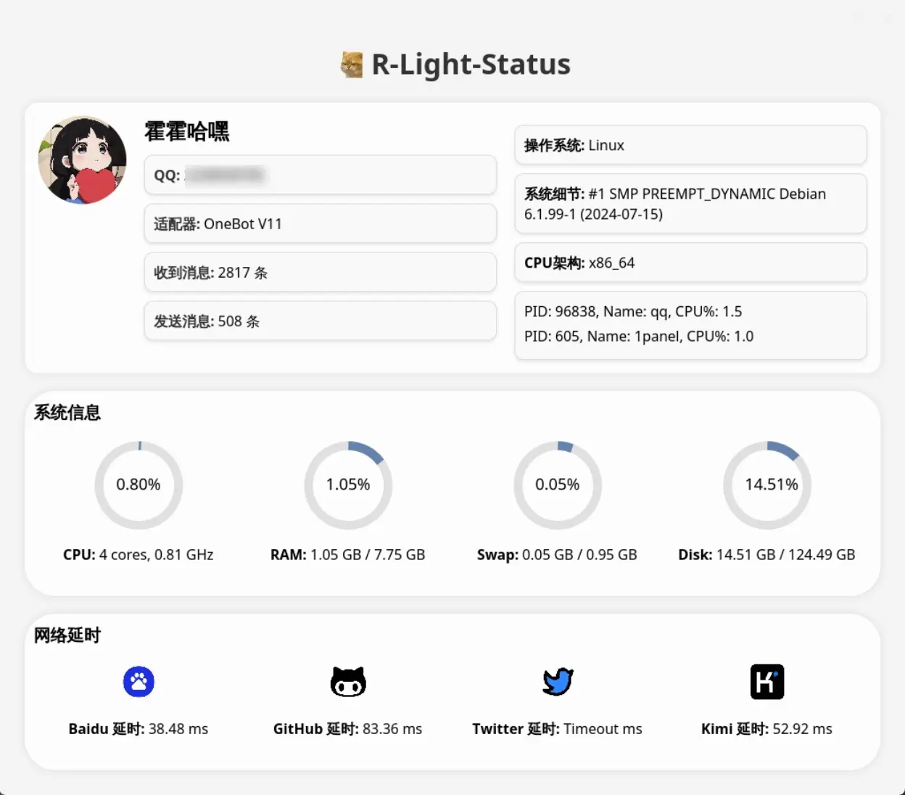

  
   
  

# nonebot-plugin-light-status

_✨ 适用于 Nonebot2 的系统信息实时查询，主打轻量级！ ✨_

## 🎉 使用

### 说明

需要安装 `imgkit`：

Debian/Ubuntu:
> apt-get install wkhtmltopdf

Mac：
> brew install --cask wkhtmltopdf

### 指令表
|   指令   | 权限 | 需要@ | 范围  | 说明 |
|:------:|:----:|:----:|:---:|:----:|
|   状态   | 群员 | 否 | 都支持 | 指令说明 |
|  运行状态  | 群员 | 否 | 都支持  | 指令说明 |
| status | 群员 | 否 | 都支持  | 指令说明 |
|   st   | 群员 | 否 | 都支持  | 指令说明 |

## 效果图

